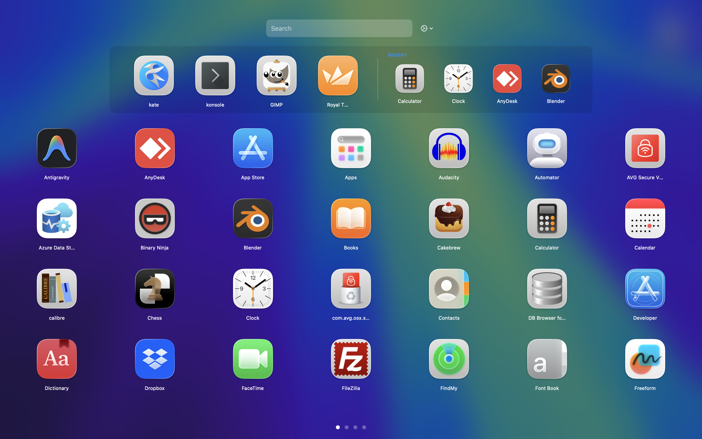

# LaunchpadPlus

LaunchpadPlus is a modern and customizable alternative application launcher for macOS, developed using Swift and SwiftUI.

## Overview

LaunchpadPlus enhances the standard macOS Launchpad experience by providing advanced customization options, dynamic sorting, and a fluid user interface designed for improved productivity.

## Primary Features

- **Foldering System**: Group applications into named folders with ease. Supports drag-and-drop folder creation, renaming, and mass-dissolving.
- **Recently Opened**: A dynamic row showing your last 5 used applications. Can be positioned to the Side of Favorites or in a dedicated Bottom row.
- **Hidden Apps Management**: Keep your launcher clean by hiding system utilities or rarely used apps via a dedicated manager view.
- **Full-Screen Coverage**: The interface covers the entire display, providing a immersive experience.
- **Dynamic Sorting Options**:
  - **Alphabetical**: Standard A-Z organization.
  - **Installation Date**: Sorts applications by metadata.
  - **Most Used**: Ranks applications based on usage counts.
  - **Manual**: Custom arrangements via drag-and-drop.
- **Favorites Bar**: A persistent "Dock" at the top of every page for your most important apps.
- **Multi-language Support**: Fully localized in English and Turkish. Supports automatic system language detection and manual switching in settings.
- **Launch at Login**: Perfectly integrated with macOS background services to start as soon as you log in.
- **Advanced UI/UX**:
  - **Glassmorphism Design**: High-end background blur and premium aesthetics.
  - **Micro-animations**: Smooth hover transitions and spring animations.
  - **Keyboard Mastery**: Full arrow-key navigation, instant search, and customizable global hotkey.

## Technical Specifications

- **Development Environment**: Swift 5.9 or newer.
- **Architecture**: Hybrid structure using SwiftUI for the user interface and AppKit for window and system event management.
- **Monitoring Infrastructure**: Uses FSEvents to observe file system changes in background threads.
- **Data Persistence**: Settings, usage counts, and custom configurations are managed via UserDefaults.
- **System APIs**: Integration with Carbon for global hotkey handling and NSWorkspace for low-level application interactions.

## Installation

### From Source

1. Clone the repository to the local machine.
2. Build the project using the command: `swift build -c release`.
3. Package the application by executing the script: `bash bundle_app.sh`.

## Contributing

Professional contributions are welcome. Please utilize the standard repository fork and pull request workflow for any proposed changes.

## License

This project is licensed under the MIT License. Detailed information is available in the LICENSE file.

---
Development is focused on modern macOS design principles and efficient application management.
